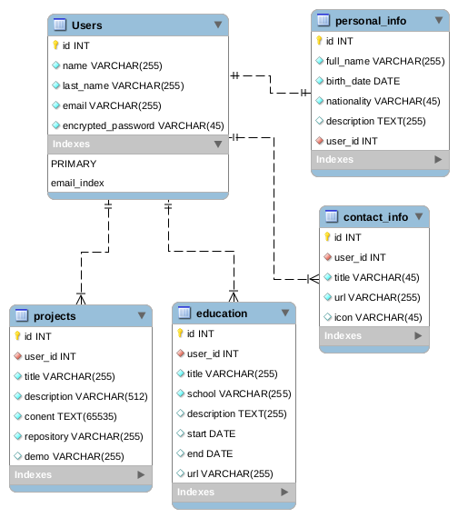

# Personal Portfolio

> Personal portfolio project is a web application intended for post and show my work, projects, articles and other
> interesting stuff in one place. 

## Built With
Languages
- 

Frameworks
- 

Technologies
- 

## ERD

## Live Demo

[Live Demo Link](https://oscardelalanza.com)

## Authors

👤 **Oscar De La Lanza**

- Github: [@oscardelalanza](https://github.com/oscardelalanza)
- Twitter: [@oscardelalanza](https://twitter.com/oscardelalanza)
- Linkedin: [Oscar De La Lanza](https://linkedin.com/in/oscardelalanza)
- Email: [oscardelalanza@gmail.com](mailto:oscardelalanza@gmail.com)

## 🤝 Contributing

Contributions, issues and feature requests are welcome!

Feel free to check the [issues page](https://github.com/oscardelalanza/personal-portfolio/issues).

## Show your support

Give a ⭐️ if you like this project!

## Acknowledgments

- Hat tip to anyone whose code was used
- Inspiration
- etc

## 📝 License

This project is [GNU GENERAL PUBLIC LICENSE](https://www.gnu.org/licenses/gpl-3.0.html) licensed.
 
