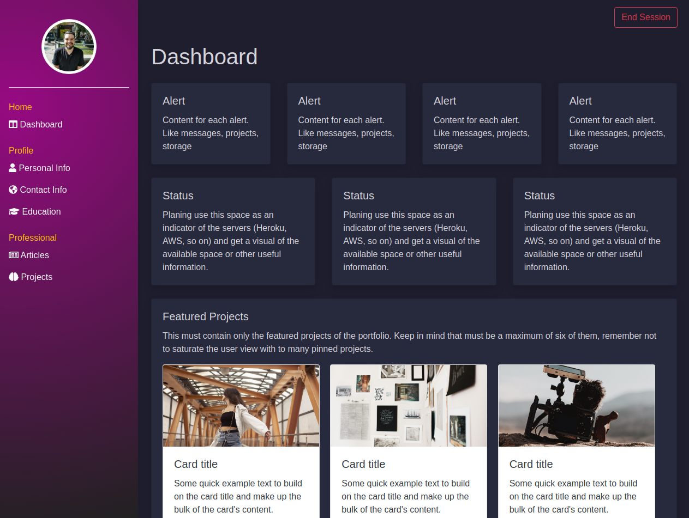
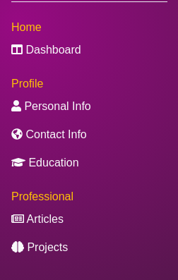

# Personal Portfolio [*On Development*]

> Personal portfolio project is a web application intended for post and show my work, projects, articles and other
> interesting stuff in one place. 

## Built With
Languages
- 

Frameworks
- 

Technologies
- 

## ERD

## Live Demo

[Live Demo Link](https://oscardelalanza-portfolio.herokuapp.com)

## Getting Started

# This project still on development

> To get a local copy up and running follow these simple example steps.

### Prerequisites

- `Ruby 2.7.0`
- `Rails 6`
- `Git`
- `PostgreSQL`
- `Yarn`
- `AWS account`

### Setup

To clone the project into your local environment do the following.

- Open a new `terminal` window and navigate to the directory where the project will be stored.
- Run the command `git clone git@github.com:oscardelalanza/personal-portfolio.git`.
- Run the command cd `personal-portfolio` to enter the project directory.

### Install

To install the required packages do the following.

- Run the command `bundle install --without-production` to install the required gems.
- Run the command `yarn install` to install the required node modules.
- Run the command `rails db:migrate` to install de database.

### Usage (Dashboard)

#### Home
##### Dashboard *Only for the admin user*

This section only contain `one` admin user. Get access to the dashboard following the path `/dashboard`.

In the right side of the dashboard, you will find the navigation links that will redirect you to the different features of the project.

*More features of the dashboard still on development*

#### Profile
##### Personal info *Only for the admin user*

- Use this to update your personal information like `name`, `birth date`, `bio`.

**Full features on development**

##### Contact info *Only for the admin user*

- Use this to add your different contact information like `phone number`, `twitter profile`, `LinkedIn`, and so on.

**Full features on development**

##### Education

- Use this to add your education info.

**Full features on development**

#### Professional
##### Articles

- Use this section to post the links to your articles.

**Full features on development**

##### Projects

- Use this to create a post explaining your projects. You can include screenshots, links, instructions, and similar.
**Full features on development** 

### Run tests

- Run the command `rails tests`. 

### Deployment

To start the development server do the following.
- Run the command `rails server`.

### Future features

- Add editing and removing options to the sections `projects`, `articles`, `contact`, `education`.
- Display pinned `projects` and `articles` in the corresponding section in the dashboard.
- Add errors `alerts/messages` to the forms.
- Add messages form.
- Display dashboard info in homepage. 

## Authors

👤 **Oscar De La Lanza**

- Github: [@oscardelalanza](https://github.com/oscardelalanza)
- Twitter: [@oscardelalanza](https://twitter.com/oscardelalanza)
- Linkedin: [Oscar De La Lanza](https://linkedin.com/in/oscardelalanza)
- Email: [oscardelalanza@gmail.com](mailto:oscardelalanza@gmail.com)

## 🤝 Contributing

Contributions, issues and feature requests are welcome!

Feel free to check the [issues page](https://github.com/oscardelalanza/personal-portfolio/issues).

## Show your support

Give a ⭐️ if you like this project!

## 📝 License

This project is [GNU GENERAL PUBLIC LICENSE](https://www.gnu.org/licenses/gpl-3.0.html) licensed.
 
